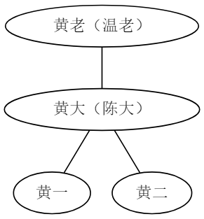
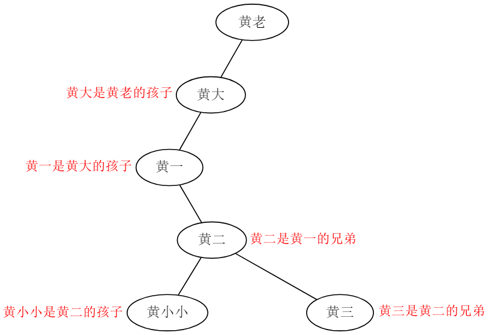

# 数据结构课程设计--族谱管理系统的设计与实现

## 课程设计项目及要求

1. 项目名称：族谱管理系统的设计与实现
2. 目的要求：采用树型结构实现族谱的创建、查询、插入等相关操作。
3. 设计项目要求：

根据提供的三个文档，创建族谱，各文档说明如下：

**表1 数据信息表**

baseinfo.txt

```txt has-numbering
6
460035195601100997 黄老
310102195909150164 温老
230108197902205711 黄大
360429198109207204 陈大
420800200905185789 黄一
420800201505185712 黄二
1234567
```

marriageinfo.txt

```txt has-numbering
2
460035195601100997 310102195909150164
230108197902205711 360429198109207204
123
```

childinfo.txt

```txt has-numbering
2
460035195601100997 230108197902205711
230108197902205711 420800200905185789 420800201505185712
123
```

**表2 项目要求**
[](images/2.png)

## 项目的实现

### 灵机一动

根据以上三个文件的信息得到的族谱图：

[](images/zuputu.png)

族谱图以男性为主线，所有结点都为男性，括号中的是配偶。

族谱图很明显是树状的，可以用树形结构来表示。

在《数据结构》课程中，我们只学过二叉树，而族谱树是多叉树，不是二叉树。那我们怎么表示族谱这棵树呢？

既然相同的数字信息既可以用十进制表示，也可以用二进制表示，那么一般的多叉树能否也用二叉树表示呢？如果它能用二叉树表示的话，那么我们就可以用已经学过的知识来处理这个问题了。

通过查询资料，我找到了“树的左孩子右兄弟表示法”，实际上就是用二叉树来表示任意树。

普通的多叉树，结点的分支结点，永远表示该节点的“孩子”。

而“树的左孩子右兄弟表示法”是这样的，给二叉树结点的左右两个分支结点分别赋予不同的含义，左边固定表示该结点的“孩子”，右边固定表示该结点的“兄弟”。

普通的家谱树（多叉树）
[](images/tree.png)

用左孩子右兄弟表示法表示的家谱树（二叉树）
[](images/tree1.png)

以上两个图表示的信息是等价的。

### 代码的实现

总共6个类。

[](images/class.png)

运行界面截图

[](images/cli.png)

说起来好累，还是看代码吧，有比较详细的注释。
